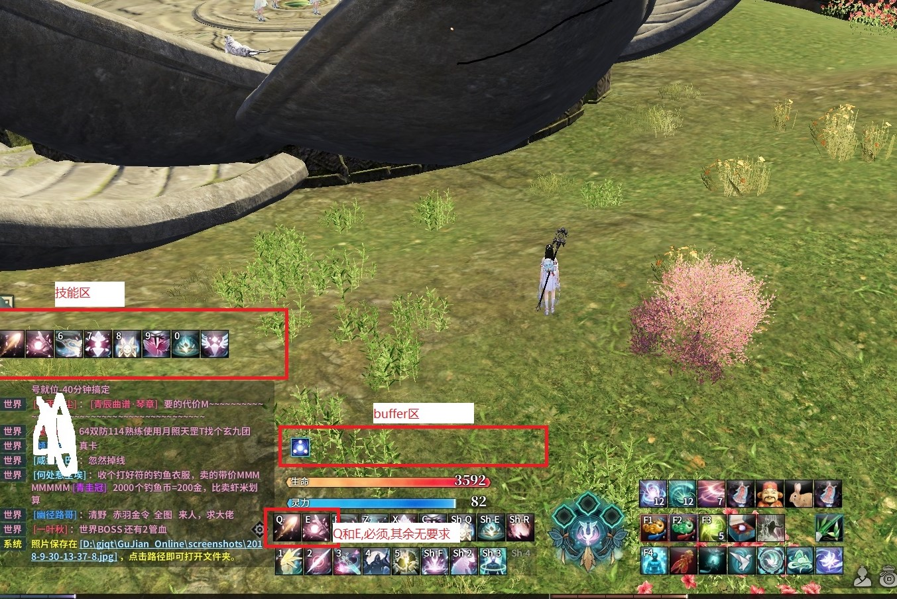

## 基本使用使用
1. 下载 [脚本](https://pan.baidu.com/s/1egtPQg85stBGr10x_6NubA)  
2. 解压到`C:\gjqt-script`(啥,你解压到D盘...复制过去就好了)
3. 按下`win`键输出 `cmd`  会看到`命令提示符` 或`命令行` 之类的东西,右键`以管理员身份运行`
4. 输入 `cd C:\gjqt-script` 回车
### fish
- 输入 `.\main.exe fish 1` 回车,意味着钓鱼1次,
- 输入 `.\main.exe fish 2` 回车,意味着钓鱼2次,
- 输入`.\main.exe fish 99` 回车,意味着钓鱼99次
- ...以此类推

备注:  
0. 用于 `四海生金` 不会移动找金点蓝点
1. 分数约在800左右,只适合像吾着般毫无追求的人使用,
1. 在输入完命令之后,需要将窗口切换至[古剑奇谭ol]  
1. 勿遮挡,或最小化,  
1. 检查分辨率是否为 `1050*1680`,只支持该分辨率,  
1. 记得在游戏中使用钓鱼竿进入钓鱼状态,并上好鱼饵  

### 司命 输出:  
##### 设置好界面(技能区,buffer区,和Q,E键)

##### 设置技能  
技能区的技能必须如此设置

| 位置 | 技能  | 快捷键 |
|------|-------|--------|
| 一   | Q技能 | 无     |
| 二   | E技能 | 无     |
| 三   | 虹光  | 6      |
| 四   | 滚石  | 7      |
| 五   | 明视  | 8      |
| 六   | 赐福  | 9      |
| 七   | 玉虹  | 0      |
##### 命令:
1. `.\main.exe si-ming-gua-ji-test` 会截取,技能区,buffer区,符文区,可以用来判断界面设置是否符合脚本期望
1. `.\main.exe si-ming-gua-ji` 启动司命输出脚本,切换到游戏,按`[F5]`键,便会输出,在按`[F5]` 停止输出,

##### 备注:
1. 不会移动,不会开减伤,不会躲技能,
1. 在脚本释放技能的时候可以手动移动,释放技能,不冲突的
2. 赐福的释放有若干bug,可以将它从技能区移除,自己手动决定何时释放,对脚本输出没影响只是无法释放赐福而已
3. `千劫万壑`需手动释放,脚本会监控是否释放了这个技能,如果有这个技能的Buffer,会进入无限`E`技能,

